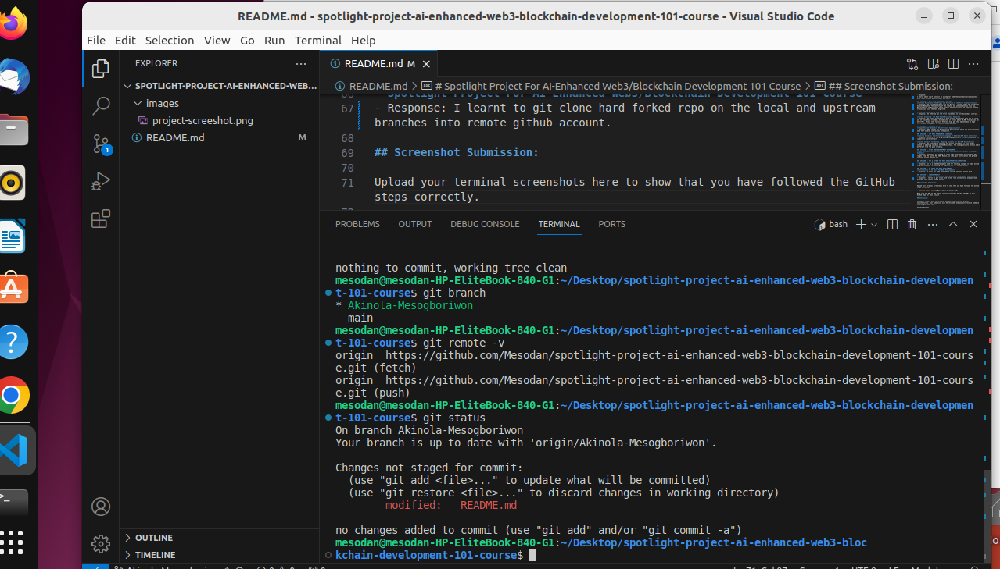

# Spotlight Project For AI-Enhanced Web3/Blockchain Development 101 Course

Welcome to the Spotlight Project for the AI-Enhanced Web3/Blockchain Development 101 Course at dProgramming University. Follow the instructions below to complete your project submission.

## Project Instructions:

1. Star and fork this repository.
2. Clone your forked repository to your local machine.
3. Create and switch to a new branch named after your certificate name.
4. Answer the questions provided in each section summary.
5. Take a screenshot of your terminal after running `git remote -v` and `git status`.
6. Push your changes and open a pull request to merge your branch into the main branch of this repository.

## Section Summaries:

### SECTION 1: THE WEB3 REVOLUTION
**Exploring the Web3 Revolution: The New Decentralized Internet**
- Response: 

I learn about how Web3 envolved from Web1 to Web3 and the decentralization it brought.

**Unlocking the Potential of Blockchain Technology**
- Response: 

In this lesson, I learnt alot about Blockchain technology like nodes, validator, consensor to prepare me as a Blockchain developer.

### SECTION 2: SMART CONTRACTS UNVEILED
**Smart Contracts Explained: The Building Blocks of Web3**
- Response: 
I learnt about smart contract as a computer code that automatically executes when terms between parties/nodes are meant.

### SECTION 3: DIVE INTO BLOCKCHAIN PLATFORMS
**Bitcoin Blockchain: The Origin and Evolution of the First Cryptocurrency**
- Response: The first blockchain coin was Bitcoin, created under the pseudonyms Satoshi Nakamoto. The identity of the creator was unknown down to this day. Bitcoin built on Blockchain which enables decentralization of nodes to perform transaction using the hash algorithm.

**Ethereum Ecosystem: A Deep Dive into EVM Blockchains**
- Response: The Ethereum was the first blockchain to introduce smart contract.

**Solana Ecosystem: The High-Speed Blockchain Network**
- Response: The solana blockchain is fast growing blockchain that try to solve one of blockchain trilemma; Scalability. it allows about 70,000 Transaction per hour(TPS). Solana tend to solve Ethereum high gas that emanate due to high traffic and development in the Ethereum blockchain.

### SECTION 4: DECODING DAPPS
**dApps Decoded: Unpacking Decentralized Applications**
- Response:  dApp stands for Decentralize Application. These are application on web3 that enables interaction with wallet.

### SECTION 5: TOP WEB3 PROGRAMMING LANGUAGES
**Vanilla Solidity: Smart Contract Language of Ethereum/EVM Smart Contracts**
- Response: Solidity is the programming language used to write Ethereum and EVM compatible smart contract.

**Solang Solidity for Solana: Adapting Solidity for Non-EVM Blockchains**
- Response: The programming language for Solana blockchain is Rust. Today, solana is adapting solidity to the Blockchain. The solang solidity here is a bit different from the pure solidity.

### SECTION 6: SETUP WEB3 DEVELOPMENT ENVIRONMENT
**Web3 Developer Toolbox: Setting up Web3 Development Environment (Ethereum/Solana)**
- Response: Many tools are needed to setup web3 development environment. This ranges from the system OS, IDE, Nodejs, vs code, git installation and github account, wallet setup e.t.c

### SECTION 7: GIT & GITHUB FOR WEB3 DEVELOPMENT COLLABORATION
**Introduction To Git & GitHub for Web3 Development**
- Response: Git is a web3 development used for tracking changes in code. Github is primarily used for hosting Git repositories for collaboration.

### SECTION 8: AI TOOLS FOR WEB3 DEVELOPMENT
**Introduction To AI Tools For Web3 Development**
- Response: AI tools for web3 development include Chatgpt, Google bard.  

### SECTION 9: COURSE PROJECT
**Spotlight Project For AI-Enhanced Web3/Blockchain Development 101 Course**
- Response: I learnt to git clone hard forked repo on the local and upstream branches into remote github account.

## Screenshot Submission:

Upload your terminal screenshots here to show that you have followed the GitHub steps correctly.

- 

Make sure the URL of the remote in your screenshot matches the URL of your GitHub repo for this project.

## Conclusion:

Remember, to earn your certificate, you must complete this project satisfactorily. Your submission will be reviewed, and you will receive feedback accordingly. Good luck!

Solomon Foskaay

Founder,

[dProgramming University](https://dProgrammingUniversity.com)

